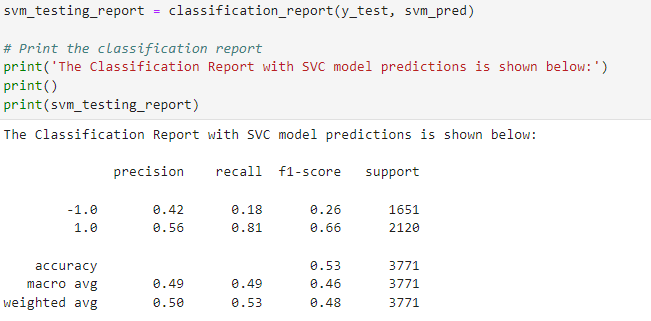
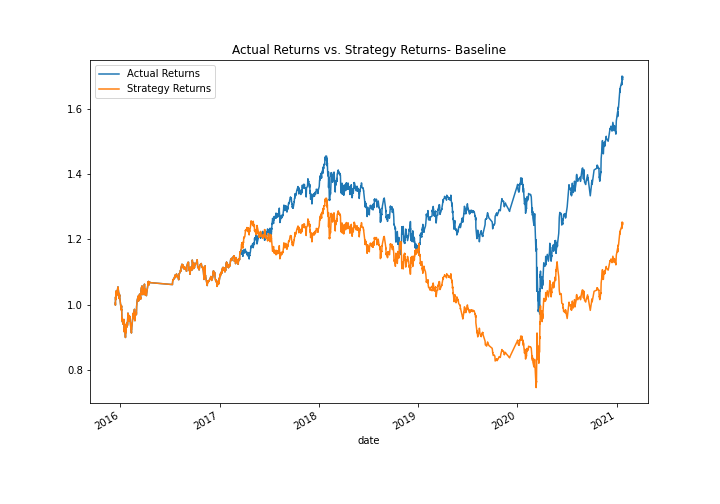
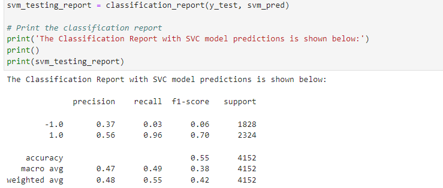
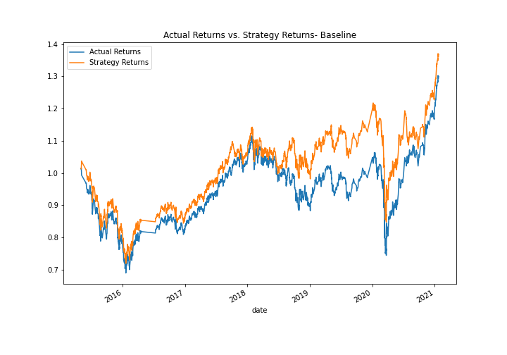
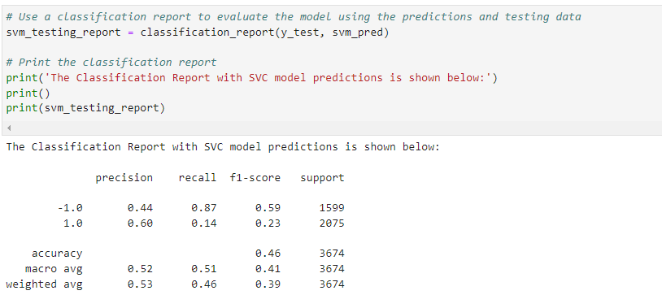
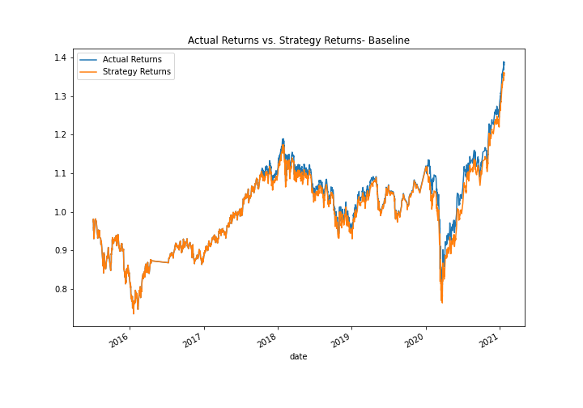
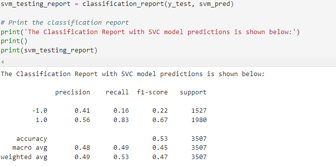
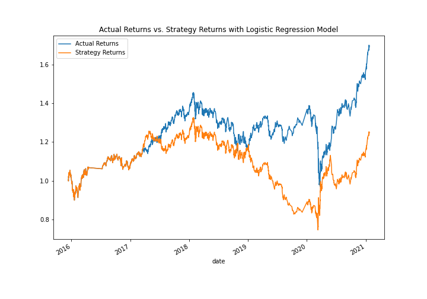
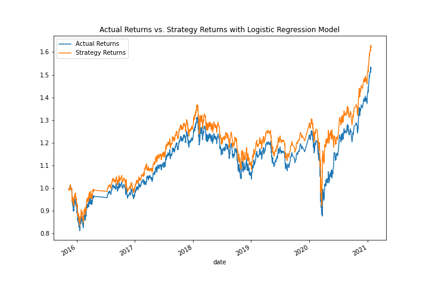

### Machine Learning Trading Bot 
The goal of this project is to maintain the firm's competitive advantage in the market while enhancing the current algorithmic trading systems. At the firm, we employ a baseline trading algorithm and a baseline model. To test whether a particular machine learning model is better and will therefore produce better results, we employ another model.

## Technologies
The following package from Python 3.7 is used in this project:

Jupyterlab Notebook

Pandas 

DateOffset

Jupyter Lab

hvplot

Scikit Learn 

Standard Scaler

OneHotEncoder

Classification report 

## Usage
Simply clone the repository and execute the  machine_learning_trading_bot.ipynb to run this program:

 machine_learning_trading_bot.ipynb

## Results
# What impact resulted from increasing or decreasing the training window?
Increasing the training window to six (6) months:The rating for accuracy increased to 56% as a result. This led to an increase in the Strategy Returns to above 1.8. From 96% to 98%, the recall for version 1.0 was also improved.

Decreasing the training window to one (1) month: The accuracy score increased to 55% as a result. Its accuracy for detecting -1.0 was also decreased to 37% from 43% at baseline. In addition, the Strategy Returns are 1.38 as opposed to our baseline of more than 1.5, which seems to have decreased our Actual Returns.

# What impact resulted from increasing or decreasing either or both of the SMA windows?
Short window = 5 days, Long window = 100 days: Our strategy returns are greater at 1.38 and our actual returns are higher at 1.4. However, the accuracy score in our classification matrix, as well as our precision for 1.0, dramatically dropped to 46%.

Short window = 10 days, Long window = 100 days: All 0.0 in our classification matrix for -1.0. Therefore, even in our graphic, Strategy Returns is the only variable that has a high of 1.38.

# What impact resulted from increasing or decreasing either or both of the SMA windows?
According to my findings, the Strategy Returns and our recall both increase if our training window dateoffset is raised to six months from the baseline of three (three) months. The algorithm returns seem to be improved as a result.

# Did this new model perform better or worse than the provided baseline model? Did this new model perform better or worse than your tuned trading algorithm?
When we plotted the results, the Strategy Returns were capped at 1.6 as opposed to when we had an SVM model, which yielded at 1.8, so this Logistic Regression model (our new model) didn't do any better at generating greater returns on the Strategy returns if we use a DateOffset of six (6) months. The Classification Report, however, revealed that the improved precision result for -1.0 is at 52% compared to a 44% (SVM model).

We used the 6 months dateoffset because this yielded the best result with the SVM model.

3 months

## Contributors
Contributed by Nayana Narayanan.

## License
MIT License